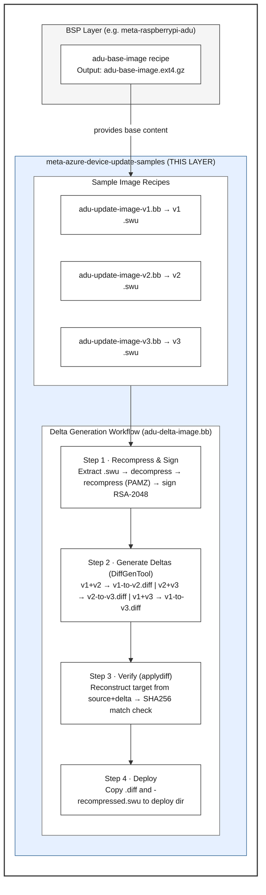

# meta-azure-device-update-samples

**Board-agnostic Yocto layer for Azure Device Update delta generation, testing, and reference workflows**

## Table of Contents

- [Why Use This Layer for Delta Updates?](#why-use-this-layer-for-delta-updates)
- [Important Notice](#important-notice)
- [Purpose](#purpose)
- [Architecture Overview](#architecture-overview)
- [Quick Start](#quick-start)
  - [Prerequisites](#prerequisites)
  - [1. Add Layer to Your Build](#1-add-layer-to-your-build)
  - [2. Build Sample Update Images](#2-build-sample-update-images)
  - [3. Generate Delta Files](#3-generate-delta-files)
- [Recipes Provided](#recipes-provided)
  - [Sample Image Recipes](#sample-image-recipes)
  - [Delta Generation Recipe](#delta-generation-recipe)
  - [BBClass: adu-timestamp-check.bbclass](#bbclass-adu-timestamp-checkbbclass)
- [Layer Configuration](#layer-configuration)
  - [Layer Dependencies](#layer-dependencies)
  - [Default Variables](#default-variables)
  - [Version Strategy](#version-strategy)
- [Demonstration Scenarios](#demonstration-scenarios)
  - [Demo 1: Full-Image Update (Basic)](#demo-1-full-image-update-basic)
  - [Demo 2: Delta Update (Advanced)](#demo-2-delta-update-advanced)
  - [Demo 3: Multi-Version Update Chain](#demo-3-multi-version-update-chain)
- [Troubleshooting](#troubleshooting)
  - [Build Issues](#build-issues)
  - [Delta Generation Issues](#delta-generation-issues)
  - [Configuration Issues](#configuration-issues)
- [Testing and Validation](#testing-and-validation)
- [Reference Workflow: Adapting for Your Product](#reference-workflow-adapting-for-your-product)
- [Contributing](#contributing)
- [License](#license)
- [Related Documentation](#related-documentation)
- [Support and Contact](#support-and-contact)

---

## Why Use This Layer for Delta Updates?

**Azure Device Update (ADU) Delta Updates can dramatically reduce OTA bandwidth and deployment costs** — but implementing delta generation in your build pipeline can be complex. This layer solves that problem by providing a **complete, tested, production-ready workflow** for automated delta generation.

### Key Benefits

🚀 **Automated Delta Generation**
- Integrates directly into your Yocto/BitBake build workflow
- No manual scripting or external tools needed
- Generates deltas automatically whenever you build new update images

✅ **Built-in Verification**
- Every delta is automatically verified during the build
- Build fails if delta reconstruction doesn't match the target
- Prevents deployment of corrupted or broken deltas

⚡ **Proven Efficiency**
- Delta files are considerably smaller than full images — actual savings depend on content differences, filesystem structure, and delta generation algorithms
- Lower cloud egress costs and deployment time
- Enable updates over bandwidth-constrained networks (cellular, satellite)

🔧 **Production-Ready Architecture**
- Task serialization prevents race conditions and file conflicts
- Automatic cleanup of stale artifacts (no manual intervention)
- Reproducible builds with proper dependency tracking

📚 **Reference Implementation**
- Complete example showing best practices
- Three versioned sample images (v1/v2/v3) for testing
- Adapt the workflow to your specific hardware and update strategy

### Who Should Use This Layer?

- **Device Builders** — Implementing ADU on embedded devices (Raspberry Pi, custom boards)
- **Update Builders** — Creating efficient OTA update workflows for IoT fleets
- **Product Teams** — Reducing bandwidth costs and deployment time for firmware updates
- **Developers** — Learning ADU delta update capabilities and integration patterns

### What You Get

This layer provides everything needed for delta-enabled ADU deployments:
- ✅ Automated delta generation between any two update versions
- ✅ SWU recompression and signing pipeline
- ✅ Automatic delta reconstruction verification
- ✅ BitBake integration with proper task dependencies
- ✅ Sample images demonstrating version management
- ✅ Complete documentation and troubleshooting guides

**Start reducing your OTA bandwidth today** — just add this layer to your Yocto build and follow the Quick Start guide below.

---

## Important Notice

**This layer is intended for DEMONSTRATION and REFERENCE purposes only.**

The artifacts generated by this layer (sample update images v1/v2/v3 and delta files) are **example implementations** designed to:
- Demonstrate Azure Device Update delta generation capabilities
- Provide a **reference workflow** for automating delta artifact creation
- Enable testing and validation of delta update scenarios
- Serve as a **starting point** for device builders and update builders

**For production deployments**, you must:
- Customize recipes for your specific hardware platform
- Adapt the delta generation workflow to your update strategy
- Implement proper security, versioning, and rollback mechanisms
- Test thoroughly on your target devices

---

## Purpose

This layer provides a **platform-independent reference implementation** showing how to:

1. **Automate delta generation** between SWUpdate update packages
2. **Integrate with BitBake build workflows** for repeatable, auditable delta creation
3. **Verify delta integrity** automatically during the build process
4. **Structure versioned update artifacts** for Azure Device Update deployment

### What This Layer Demonstrates

- ✅ **Automated delta generation workflow** - Complete BitBake recipes for creating binary diff packages
- ✅ **Recompression and signing pipeline** - Preparation of SWUpdate files for delta-compatible format
- ✅ **Built-in verification** - Automatic delta reconstruction validation before deployment
- ✅ **Versioned sample images** - Three pre-configured update images (v1.0.0, v2.0.0, v3.0.0) for testing
- ✅ **Board-agnostic design** - Separates delta generation logic from hardware-specific configuration

### What This Layer Does NOT Provide

This layer is **board-agnostic** by design. Your BSP (Board Support Package) layer must provide:

- ❌ **Base image content** - Platform-specific rootfs, kernel, drivers, firmware
- ❌ **Boot infrastructure** - Hardware-specific bootloader configuration (U-Boot, GRUB, etc.)
- ❌ **Partition layouts** - Board-specific storage strategies and A/B update mechanisms
- ❌ **Production configuration** - Real versioning strategy, security policies, rollback mechanisms

**Example BSP Layer**: See `meta-raspberrypi-adu` for a complete Raspberry Pi 4 implementation that provides these components.

---

## Architecture Overview



**Output** in `tmp/deploy/images/<MACHINE>/`:

| Artifact | Description | Size (sample) |
|----------|-------------|---------------|
| `adu-update-image-v*-<MACHINE>.swu` | Original signed SWU packages | Full image |
| `adu-update-image-v*.0.0-recompressed.swu` | Recompressed for delta source | Full image |
| `adu-delta-v1-to-v2.diff` | Binary delta (v1→v2) | Varies |
| `adu-delta-v2-to-v3.diff` | Binary delta (v2→v3) | Varies |
| `adu-delta-v1-to-v3.diff` | Binary delta (v1→v3, skip) | Varies |

> Delta sizes depend on actual content differences, filesystem structure,
> and delta generation algorithms. Expect considerably smaller files than
> full images, but exact savings vary by use case.

---

## Quick Start

### Prerequisites

**Required BitBake Variables** (set in `conf/local.conf` or BSP layer):

```bitbake
# REQUIRED: RSA signing keys for SWUpdate package verification
ADUC_PRIVATE_KEY = "/path/to/keys/priv.pem"          # RSA-2048 private key
ADUC_PRIVATE_KEY_PASSWORD = "/path/to/keys/priv.pass" # Key password file

# OPTIONAL: ADU manifest metadata (defaults shown)
ADU_PROVIDER ?= "Contoso"              # Your company/organization name
ADU_MODEL ?= "Sample-Device"           # Device model identifier
BASE_ADU_SOFTWARE_VERSION ?= "1.0.0"   # Base version (informational)
```

**Required Base Image:**

The recipes depend on `adu-base-image` by name. Your BSP layer must provide an image recipe named `adu-base-image` (e.g., in `meta-raspberrypi-adu`).

---

### 1. Add Layer to Your Build

The layer is automatically included if you're using the `iot-hub-device-update-yocto` repository. For manual setup:

```bash
# Add required dependencies first
bitbake-layers add-layer ../meta-azure-device-update
bitbake-layers add-layer ../meta-iot-hub-device-update-delta
bitbake-layers add-layer ../meta-swupdate
bitbake-layers add-layer ../meta-clang

# Add samples layer
bitbake-layers add-layer ../meta-azure-device-update-samples
```

### 2. Build Sample Update Images

```bash
# Build all three versioned sample images (v1.0.0, v2.0.0, v3.0.0)
bitbake adu-update-image-v1 adu-update-image-v2 adu-update-image-v3

# Or use the convenience script (if using iot-hub-device-update-yocto repo)
cd ~/adu_yocto/iot-hub-device-update-yocto
./scripts/build.sh --rebuild adu-update-image-v1,adu-update-image-v2,adu-update-image-v3
```

**Output:** Three signed SWUpdate packages in `tmp/deploy/images/<MACHINE>/`

### 3. Generate Delta Files

```bash
# Generate all delta files with automatic verification
bitbake adu-delta-image
```

**What happens during the build:**

1. **Recompression Phase** (Tasks: `do_recompress_and_sign_v1/v2/v3`)
   - Extracts each .swu file
   - Decompresses .ext4.gz images
   - Recompresses with PAMZ-compatible format
   - Signs with RSA-2048 key (using `openssl dgst`)
   - Creates `*-recompressed.swu` files (3 files each: sw-description, sw-description.sig, image)

2. **Delta Generation Phase** (Tasks: `do_generate_delta_v1_v2/v2_v3/v1_v3`) **← RUNS SERIALLY**
   - Uses C# DiffGenTool (PAMZ format, P/Invoke to libadudiffapi.so)
   - **Task ordering prevents file conflicts:** v1→v2 first, then v1→v3, finally v2→v3
   - This serialization prevents "Working directory was already used" errors when multiple tasks try to access the same source file (e.g., v1) simultaneously
   - Generates binary diffs between recompressed files
   - Creates `.diff` files

3. **Verification Phase** (Tasks: `do_verify_delta_v1_v2/v2_v3/v1_v3`) **← AUTOMATIC QUALITY CHECK**
   - Uses C++ `applydiff` tool to reconstruct target from source + delta
   - Compares SHA256 hash of reconstructed vs. original target
   - **Build fails if verification fails** (prevents broken deltas from being deployed)

4. **Deployment Phase** (`do_deploy`)
   - Copies `.diff` and `*-recompressed.swu` files to deploy directory
   - Generates SHA256 checksum files for each artifact

**Output files in `tmp/deploy/images/<MACHINE>/`:**
- `adu-delta-v1-to-v2.diff` (considerably smaller than the full .swu)
- `adu-delta-v2-to-v3.diff` (considerably smaller than the full .swu)
- `adu-delta-v1-to-v3.diff` (considerably smaller than the full .swu)
- `adu-update-image-v*.0.0-recompressed.swu` (3 files)
- `*.sha256` checksum files

**Note on delta sizes:** The actual delta size depends on the content differences between versions. In this sample implementation, v1→v2 and v2→v3 contain significant changes, while v1→v3 is optimized with minimal differences, demonstrating the range of possible delta sizes.

---

## Recipes Provided

### Sample Image Recipes
Located in `recipes-samples/images/`:

- **`adu-update-image-v1.bb`** - Base version (v1.0.0.1)
  - Wraps `adu-base-image` rootfs in a signed SWUpdate package
  - Sets `ADU_SOFTWARE_VERSION = "1.0.0.1"`
  - Inherits: `swupdate` (via `adu-update-image-common.inc`)
  - Output: `adu-update-image-v1-<MACHINE>.swu`

- **`adu-update-image-v2.bb`** - Incremental update (v1.0.0.2)
  - Sets `ADU_SOFTWARE_VERSION = "1.0.0.2"`
  - Adds version marker file (`/etc/adu-image-version`) to create content difference from v1
  - Output: `adu-update-image-v2-<MACHINE>.swu`

- **`adu-update-image-v3.bb`** - Second incremental (v1.0.0.3)
  - Sets `ADU_SOFTWARE_VERSION = "1.0.0.3"`
  - Adds version marker file to create content difference from v2
  - Output: `adu-update-image-v3-<MACHINE>.swu`

- **`adu-update-image-common.inc`** - Shared configuration for all versioned images
  - Unpacks `adu-base-image.ext4.gz`, stamps `/etc/adu-version` with the target version using `debugfs`, repacks as `${PN}.ext4.gz`
  - Signs with RSA key, inherits `swupdate` for `.swu` packaging
  - Deploys `.adu-version` sidecar file for easy version lookup without extracting `.swu`
  - Inherits `adu-timestamp-check` to auto-clean stale artifacts

**Key Recipe Dependencies:**
```bitbake
DEPENDS += "adu-base-image swupdate e2fsprogs-native"
do_swuimage[depends] += "adu-base-image:do_image_complete"
```

### Delta Generation Recipe
Located in `recipes-samples/delta-generation/`:

- **`adu-delta-image.bb`** - Complete delta generation workflow
  - **Native tool dependencies:**
    - `iot-hub-device-update-delta-diffgentool-native` (C# DiffGenTool for PAMZ format)
    - `iot-hub-device-update-delta-processor-native` (C++ applydiff, recompress tools)
    - `cpio-native` (for SWU extraction/creation)
  
  - **Key tasks:**
    - `do_recompress_and_sign_v1/v2/v3` - Prepare recompressed+signed files
    - `do_generate_delta_v1_v2/v2_v3/v1_v3` - Generate binary diffs
    - `do_verify_delta_v1_v2/v2_v3/v1_v3` - Verify delta reconstruction
    - `do_verify_all_deltas` - Aggregate verification
    - `do_deploy` - Deploy artifacts to deploy directory
  
  - **Task dependencies:**
```bitbake
# Delta generation tasks run SERIALLY to prevent file conflicts
# when multiple tasks access the same source file (e.g., v1)
do_generate_delta_v1_v2[depends] = "\
    adu-delta-image:do_recompress_and_sign_v1 \
    adu-delta-image:do_recompress_and_sign_v2 \
    iot-hub-device-update-delta-diffgentool-native:do_populate_sysroot \
"

# v1→v3 runs AFTER v1→v2 completes (both access v1 source)
do_generate_delta_v1_v3[depends] = "\
    adu-delta-image:do_recompress_and_sign_v1 \
    adu-delta-image:do_recompress_and_sign_v3 \
    adu-delta-image:do_generate_delta_v1_v2 \
    iot-hub-device-update-delta-diffgentool-native:do_populate_sysroot \
"

# v2→v3 runs LAST (after both v1-based deltas complete)
do_generate_delta_v2_v3[depends] = "\
    adu-delta-image:do_recompress_and_sign_v2 \
    adu-delta-image:do_recompress_and_sign_v3 \
    adu-delta-image:do_generate_delta_v1_v3 \
    iot-hub-device-update-delta-diffgentool-native:do_populate_sysroot \
"

do_verify_delta_v1_v2[depends] = "\
    adu-delta-image:do_generate_delta_v1_v2 \
    iot-hub-device-update-delta-processor-native:do_populate_sysroot \
"
```
  
  - **Task serialization:** Delta generation tasks run serially (not in parallel) to prevent file sharing violations when multiple tasks access the same source file simultaneously. For example, v1→v2 and v1→v3 both read the v1 source file, so v1→v3 waits for v1→v2 to complete before starting.
  
  - **Output files:**
    - `adu-delta-v1-to-v2.diff`, `adu-delta-v2-to-v3.diff`, `adu-delta-v1-to-v3.diff`
    - `adu-update-image-v*.0.0-recompressed.swu` (3 files)
    - `*.sha256` checksum files

### BBClass: adu-timestamp-check.bbclass
Located in `classes/`:

- **Purpose:** Validates that update and delta artifacts are newer than the base image to prevent deployment of stale artifacts
- **Automatic cleanup:** When stale artifacts are detected (older than the base image), the class automatically removes them and issues warnings instead of failing the build. BitBake will then rebuild the artifacts with correct timestamps.
- **Activation:** Inherited by `adu-update-image-common.inc` (always active for update images)
- **Integration:** Automatically inherited by `adu-delta-image.bb`

**Key behavior:**
```python
# Instead of failing build with bb.fatal(), automatically cleanup:
if stale_artifacts:
    bb.warn("Auto-cleaning %d stale artifact(s)" % len(stale_artifacts))
    for artifact_file in stale_artifacts:
        bb.warn("  - Removing: %s" % os.path.basename(artifact_file))
        os.remove(artifact_file)
```

This eliminates manual intervention when rebuilding base images, as stale delta files are automatically cleaned up and regenerated.

### Script Handlers
Located in `recipes-samples/adu-scripts/`:

- **`adu-scripts.bb`** — Delta source caching handler
  - Installs `microsoft-delta-source-caching.sh` to `/usr/lib/adu/`
  - Verifies that recompressed SWU files are correctly cached after updates
  - Runtime dependencies: `bash`, `azure-device-update`, `swupdate`, `u-boot-fw-utils`

---

## Layer Configuration

### Layer Dependencies

Defined in `conf/layer.conf`:

```bitbake
LAYERDEPENDS_meta-azure-device-update-samples = " \
    core \
    azure-device-update \
    iot-hub-device-update-delta \
    swupdate \
"
```

**What each dependency provides:**

| Layer | Purpose | Key Components |
|-------|---------|----------------|
| **core** (openembedded-core) | Base Yocto functionality | BitBake, package management, toolchain |
| **azure-device-update** | ADU agent infrastructure | ADU agent recipes, configuration, device management |
| **iot-hub-device-update-delta** | **CRITICAL for delta generation** | • `bsdiff` - Binary diff tool<br>• `DiffGenTool` - C# PAMZ delta generator<br>• `applydiff` - Delta reconstruction/verification<br>• `recompress` - SWU recompression tool<br>• `libadudiffapi.so` - Core delta library<br>**Without this layer, delta generation will fail** |
| **swupdate** | SWUpdate packaging framework | SWU creation, signing, CPIO handling |

> **Note:** `clang-layer` is a transitive dependency — it is required by
> `iot-hub-device-update-delta`, not by this layer directly.

### Default Variables

Defined in `conf/distro/include/adu-samples-defaults.inc`:

```bitbake
# Software version for sample images (override in local.conf)
BASE_ADU_SOFTWARE_VERSION ??= "1.0.0"

# ADU manifest metadata (override in local.conf)
ADU_PROVIDER ??= "Contoso"
ADU_MODEL ??= "Sample-Device"
ADU_COMPATIBILITY_HARDWARE ??= "1.0"

# SWUpdate signing keys
ADUC_PRIVATE_KEY ??= "${TOPDIR}/conf/swupdate-signing/priv.pem"
ADUC_PRIVATE_KEY_PASSWORD ??= "${TOPDIR}/conf/swupdate-signing/priv.pass"

# Enable delta update feature by default
WITH_FEATURE_DELTA_UPDATE ??= "1"

# Enable v1→v3 skip-delta generation (requires ≥8GB RAM on build host)
# Set to "0" on machines with <8GB RAM to avoid OOM during diffgentool
ADU_GENERATE_V1_V3_DELTA ??= "1"
```

**To customize:** Add to your `conf/local.conf`:
```bitbake
BASE_ADU_SOFTWARE_VERSION = "2.5.0"
ADU_PROVIDER = "YourCompany"
ADU_MODEL = "YourDevice"
```

### Version Strategy

Each versioned recipe hardcodes its `ADU_SOFTWARE_VERSION`:

```
v1: ADU_SOFTWARE_VERSION = "1.0.0.1"
v2: ADU_SOFTWARE_VERSION = "1.0.0.2"
v3: ADU_SOFTWARE_VERSION = "1.0.0.3"
```

To change version numbering, edit each `adu-update-image-v*.bb` recipe directly.

**Note:** This is a **demonstration versioning strategy**. Production systems should implement:
- Semantic versioning (MAJOR.MINOR.PATCH)
- Build number tracking
- Git commit hash integration
- Release branch management

---

This layer enables multiple Azure Device Update demonstration workflows:

### Demo 1: Full-Image Update (Basic)
**Requirements**: ADU agent + device connection
**What it demonstrates**: Installing a complete update package via Azure IoT Hub

**Steps**:
1. Flash device with base image containing v1
2. Upload `adu-update-image-v2.swu` and manifest to Azure Portal
3. Deploy update to device via IoT Hub
4. Device downloads and installs v2.swu (full image package)

**Layer artifacts used**: `adu-update-image-v2.swu`

---

### Demo 2: Delta Update (Advanced)
**Requirements**: ADU agent + delta support enabled + sufficient storage
**What it demonstrates**: Efficient updates using binary diff patches

**Steps**:
1. Device running v1 (1.0.0.1)
2. Upload `adu-delta-v1-to-v2.diff` and manifest to Azure
3. Deploy delta update to device
4. Device downloads the delta file (considerably smaller than the full image)
5. Device reconstructs v2 from v1 + diff
6. Device installs reconstructed v2.swu

**Layer artifacts used**: 
- `adu-delta-v1-to-v2.diff` (binary patch)
- `adu-update-image-v1.swu` (required on device as source)

**Benefits**: 
- Significantly reduced download size compared to full image updates
- Actual savings depend on content differences, filesystem layout, and delta algorithms
- Faster OTA deployment over bandwidth-constrained connections
- Lower cloud egress costs

---

### Demo 3: Multi-Step Update Chain
**Requirements**: ADU agent + persistence layer
**What it demonstrates**: Controlled rollout through multiple versions

**Steps**:
1. Device at v1 (1.0.0.1)
2. Update to v2 (1.0.0.2) - verify functionality
3. Update to v3 (1.0.0.3) - demonstrate continuous updates
4. Optional: Rollback from v3 → v2 → v1

**Layer artifacts used**:
- `adu-update-image-v1.swu`
- `adu-update-image-v2.swu`
- `adu-update-image-v3.swu`
- `adu-delta-v1-to-v2.diff`
- `adu-delta-v2-to-v3.diff`

---

## Feature Requirements Matrix

| Feature | Layer Components | BSP Requirements | External Requirements |
|---------|-----------------|------------------|----------------------|
| **Full Image Updates** | adu-update-image-v*.bb | `adu-base-image` recipe, Boot A/B slots | Azure IoT Hub, ADU account |
| **Delta Updates** | adu-delta-image.bb | Same as above + storage for temp files | ADU with delta support enabled |
| **Test Package** | adu-delta-test-package.bb | All images + delta artifacts built | None (offline packaging) |
| **Version Testing** | All three versioned images | Persistence across updates | Test IoT Hub instance |
| **Rollback Demo** | v1, v2, v3 images | A/B boot slots with fallback | ADU agent with rollback support |

---

## Customizing for Your Platform

### Step 1: Create Your Base Image Recipe

In your BSP layer (e.g., `meta-myboard/recipes-core/images/adu-base-image.bb`):

```bitbake
require recipes-core/images/core-image-minimal.bb

DESCRIPTION = "My board base image for ADU"

# Add your board-specific packages
IMAGE_INSTALL:append = " \
    myboard-firmware \
    myboard-drivers \
"

# Configure persistence, boot, etc.
inherit adu-filesystem-layout
```

> **Note:** The recipe must be named `adu-base-image` because the sample
> image recipes depend on it by that name.

### Step 2: Configure local.conf

```bitbake
# Set your company/model info
ADU_PROVIDER = "MyCompany"
ADU_MODEL = "MyDevice-v1"

# Configure signing keys
ADUC_PRIVATE_KEY = "${TOPDIR}/../keys/priv.pem"
ADUC_PRIVATE_KEY_PASSWORD = "${TOPDIR}/../keys/priv.pass"
```

### Step 3: Build Samples

```bash
bitbake adu-update-image-v1
```

The sample images will automatically wrap your board's base image in SWUpdate format.

---

## Troubleshooting

### Build Issues

#### Issue: "adu-base-image" recipe not found

**Cause:** Your BSP layer doesn't provide an `adu-base-image` recipe.

**Solution:**

The sample image recipes depend on `adu-base-image` by name. Ensure your BSP layer provides a recipe with this name:

```bitbake
# In your BSP: recipes-core/images/adu-base-image.bb
DESCRIPTION = "My board base image for ADU"
require recipes-core/images/core-image-minimal.bb
IMAGE_INSTALL:append = " azure-device-update "
```

Verify the recipe is visible:
```bash
bitbake-layers show-recipes adu-base-image
```
   ```

---

#### Issue: "ERROR: adu-delta-image do_generate_delta_v1_v2: Recompressed file not found"

**Cause:** Recompression tasks failed or didn't run.

**Solution:**
1. Check recompression logs:
   ```bash
   cat tmp/work/*/adu-delta-image/*/temp/log.do_recompress_and_sign_v1
   ```

2. Verify signing keys exist:
   ```bash
   ls -l $ADUC_PRIVATE_KEY $ADUC_PRIVATE_KEY_PASSWORD
   ```

3. Check original .swu files were created:
   ```bash
   ls -lh tmp/deploy/images/<MACHINE>/adu-update-image-v*.swu
   ```

---

#### Issue: "Delta verification failed - reconstructed file does not match target"

**Cause:** Delta file is corrupted or base images contain non-reproducible content.

**Solution:**
1. Check verification logs for specific failure:
   ```bash
   grep -A 10 "FAIL" tmp/work/*/adu-delta-image/*/temp/log.do_verify_delta*
   ```

2. Verify SHA256 mismatch:
   ```bash
   # Compare expected vs actual hashes in log output
   ```

3. Ensure reproducible builds:
   ```bitbake
   # In your base image recipe
   INHERIT += "reproducible_build"
   SOURCE_DATE_EPOCH = "1609459200"  # Fixed timestamp
   ```

4. Clean and rebuild:
   ```bash
   bitbake -c cleansstate adu-delta-image
   bitbake adu-delta-image
   ```

---

#### Issue: "Working directory was already used by another instance"

**Cause:** Multiple delta generation tasks running in parallel tried to access the same source file simultaneously (e.g., both v1→v2 and v1→v3 accessing the v1 source file).

**Solution:** This issue is **already fixed** in the current version through task serialization. Delta generation tasks now run serially:
- v1→v2 completes first
- v1→v3 runs after v1→v2 (both need v1 source)
- v2→v3 runs last (after both v1-based deltas complete)

If you're using an older version of this layer, update to the latest version or manually add task dependencies:
```bitbake
do_generate_delta_v1_v3[depends] += "adu-delta-image:do_generate_delta_v1_v2"
do_generate_delta_v2_v3[depends] += "adu-delta-image:do_generate_delta_v1_v3"
```

---

#### Issue: diffgentool killed during v1→v3 delta generation (OOM)

**Symptom:**
```
ERROR: diffgentool failed
Killed
```
Build fails at `do_generate_delta_v1_v3`. Sequential deltas (v1→v2, v2→v3) succeed.

**Cause:** The diffgentool processes two ~218MB SWU files. On machines with <8GB RAM,
the OOM killer terminates the process during v1→v3 (skip-delta) generation.

**Solution:** Disable v1→v3 skip-delta generation:
```bitbake
# In local.conf:
ADU_GENERATE_V1_V3_DELTA = "0"
```

Or when using kas, this is set in `kas-delta.yml` by default. To re-enable on hosts with ≥8GB RAM:
```bitbake
ADU_GENERATE_V1_V3_DELTA = "1"
```

Sequential deltas (v1→v2, v2→v3) are always generated — they cover the standard update path.

> See [docs/TROUBLESHOOTING.md](../../../docs/TROUBLESHOOTING.md#tsg-007-diffgentool-killed-during-v1v3-delta-generation-oom) for memory requirements and alternative fixes.

---

#### Issue: "Timestamp validation failed - artifacts older than base image"

**Cause:** Base image was rebuilt, but delta files from previous build still exist with older timestamps.

**Solution:** This issue is **automatically handled** in the current version. The `adu-timestamp-check.bbclass` now:
1. Detects stale artifacts (older than base image)
2. Issues warnings about auto-cleanup
3. Removes stale files automatically
4. Allows BitBake to regenerate them with correct timestamps

**Old behavior (manual intervention required):**
```
ERROR: Timestamp validation failed!
# User had to manually: rm -f tmp/deploy/images/*/adu-delta*.diff
```

**New behavior (automatic):**
```
WARNING: Auto-cleaning 3 stale artifact(s)
WARNING:   - Removing: adu-delta-v1-to-v2.diff
WARNING:   - Removing: adu-delta-v2-to-v3.diff
WARNING:   - Removing: adu-delta-v1-to-v3.diff
# BitBake automatically regenerates them
```

No manual intervention needed!

---

#### Issue: Delta files are unexpectedly large (>50MB)

**Cause:** Base images contain volatile data or non-reproducible timestamps.

**Analysis:**
```bash
# Compare file contents
cpio -it < v1-recompressed.swu > v1-files.txt
cpio -it < v2-recompressed.swu > v2-files.txt
diff v1-files.txt v2-files.txt

# Check for timestamp differences
sudo mount -o loop,ro v1.ext4 /mnt/v1
sudo mount -o loop,ro v2.ext4 /mnt/v2
diff -r /mnt/v1 /mnt/v2
```

**Solution:**
- Remove logs and volatile files from rootfs:
  ```bitbake
  ROOTFS_POSTPROCESS_COMMAND += "remove_volatile_data;"
  remove_volatile_data() {
      rm -rf ${IMAGE_ROOTFS}/var/log/*
      rm -rf ${IMAGE_ROOTFS}/tmp/*
  }
  ```
- Enable reproducible builds (see above)
- Mask timestamps in ext4 filesystem

---

#### Issue: "applydiff: error while loading shared libraries: libjsoncpp.so.25"

**Cause:** Missing native library dependencies for applydiff tool.

**Solution:** This should be automatic in the recipe. If you see this error, check:
```bash
# Verify processor-native is built
bitbake -e iot-hub-device-update-delta-processor-native | grep ^STAGING_LIBDIR_NATIVE

# Check library exists
find tmp/sysroots-components/x86_64 -name "libjsoncpp.so.25"
```

**Workaround:** The recipe automatically sets LD_LIBRARY_PATH in verification tasks. If still failing, manually check:
```bash
# Review verification task environment
cat tmp/work/*/adu-delta-image/*/temp/log.do_verify_delta_v1_v2
```

---

#### Issue: "DiffGenTool: Archive is not diffable - Target archive is not diffable"

**Cause:** SWU files contain gzip-compressed .ext4.gz files, which DiffGenTool cannot process directly.

**Solution:** This is why the recompression step exists! The recipe automatically:
1. Extracts .swu archives
2. Decompresses .ext4.gz → .ext4
3. Recompresses with PAMZ-compatible format

If you still see this error, verify recompression worked:
```bash
# Check recompressed file structure
cpio -it < adu-update-image-v1.0.0-recompressed.swu
# Expected output:
# sw-description
# sw-description.sig
# adu-update-image-v1-<MACHINE>.ext4.gz  (must be .gz, not .pamz yet)
```

---

### Configuration Issues

#### Issue: "WARNING: BBFILE_COLLECTIONS version mismatch"

**Cause:** `LAYERSERIES_COMPAT` mismatch between layers.

**Solution:** Update `conf/layer.conf`:
```bitbake
LAYERSERIES_COMPAT_meta-azure-device-update-samples = "scarthgap"
```

---

#### Issue: RSA signature verification fails on device

**Cause:** Public key mismatch between build-time signing and device-side verification.

**Solution:**
1. Verify keys match:
   ```bash
   openssl rsa -in $ADUC_PRIVATE_KEY -pubout -out /tmp/pubkey.pem
   diff /tmp/pubkey.pem $ADUC_PUBLIC_KEY
   ```

2. Ensure device has correct public key:
   ```bash
   # On device
   cat /etc/swupdate/public.pem
   ```

3. Rebuild with correct keys:
   ```bash
   bitbake -c cleansstate adu-update-image-v1 adu-delta-image
   bitbake adu-update-image-v1 adu-delta-image
   ```

---

#### Issue: SWUpdate fails with "Broken pipe" or "Image invalid or corrupted"

**Symptoms:**
- Device logs show: `swupdate_image_write failed: Broken pipe`
- Error message: `description file name not the first of the list`
- SWUpdate rejects recompressed `.swu` files but accepts original files

**Cause:** Recompressed SWU files missing `sw-description.sig` or incorrect file order.

**SWUpdate requires EXACT file order:**
1. `sw-description` (MUST be first)
2. `sw-description.sig` (MUST be second)
3. Image files (ext4.gz, etc.)

**Diagnosis:**
```bash
# Check file order in recompressed SWU
cpio -it < tmp/deploy/images/<MACHINE>/adu-update-image-v1.0.0-recompressed.swu | head -5

# Expected output:
# sw-description
# sw-description.sig           ← Must be present!
# adu-update-image-v1-<MACHINE>.ext4.gz

# If sw-description.sig is missing or wrong order, rebuild
```

**Solution:**
```bash
# Rebuild delta-image recipe with clean state
bitbake -c cleansstate adu-delta-image
bitbake adu-delta-image

# Verify all recompressed files have signatures
for f in tmp/deploy/images/<MACHINE>/*-recompressed.swu; do
    echo "=== $(basename $f) ==="
    cpio -it < "$f" 2>/dev/null | head -3
done
```

**Technical Details:**
- The `do_recompress_and_sign_v1/v2/v3` tasks decompress gzip-compressed ext4 images and sign the resulting SWU
- Signing adds `sw-description.sig` file with RSA-2048 signature
- CPIO archive uses `-H crc` format with exact file ordering for SWUpdate compatibility
- Missing signatures cause SWUpdate to reject files even if sw-description itself is valid

---

## Testing and Validation

### Verify Delta Generation Pipeline

```bash
# 1. Build all components
bitbake adu-update-image-v1 adu-update-image-v2 adu-update-image-v3 adu-delta-image

# 2. Check all outputs exist
ls -lh tmp/deploy/images/<MACHINE>/adu-delta*.diff
ls -lh tmp/deploy/images/<MACHINE>/adu-update-image-v*.0.0-recompressed.swu

# 3. Verify delta integrity (automatic during build)
grep "✅ SUCCESS" tmp/work/*/adu-delta-image/*/temp/log.do_verify_delta*

# 4. Check delta sizes (should be reasonable for your content changes)
du -h tmp/deploy/images/<MACHINE>/adu-delta*.diff

# 5. Verify signature files
for f in tmp/deploy/images/<MACHINE>/*-recompressed.swu; do
    echo "=== $f ==="
    cpio -it < "$f" | grep sig
done
```

---

---

## Reference Workflow: Adapting for Your Product

This layer demonstrates a complete delta generation workflow that **device builders and update builders** can adapt for their own products. Follow these steps to customize for your hardware platform and update strategy:

### Step 1: Create Your Base Image Recipe

In your BSP layer, create a recipe named `adu-base-image` (e.g., `meta-myboard/recipes-core/images/adu-base-image.bb`):

```bitbake
require recipes-core/images/core-image-minimal.bb

DESCRIPTION = "My device base image for ADU updates"

# Add your hardware-specific packages
IMAGE_INSTALL:append = " \
    myboard-firmware \
    myboard-drivers \
    myboard-config \
    azure-device-update \
"

# Configure A/B update infrastructure
inherit adu-filesystem-layout swupdate-image
```

> **Note:** The recipe **must** be named `adu-base-image` because the sample
> image recipes depend on it by that exact name.

### Step 2: Configure BitBake Variables

In your `conf/local.conf`:

```bitbake
# Set your product metadata
ADU_PROVIDER = "MyCompany"
ADU_MODEL = "MyProduct-v2"

# Configure signing keys (generate with: openssl genrsa -aes256 -out priv.pem 2048)
ADUC_PRIVATE_KEY = "${TOPDIR}/../keys/priv.pem"
ADUC_PRIVATE_KEY_PASSWORD = "${TOPDIR}/../keys/priv.pass"
ADUC_PUBLIC_KEY = "${TOPDIR}/../keys/public.pem"
```

### Step 3: Build Your Versioned Updates

```bash
# Build base version
bitbake adu-update-image-v1

# Build subsequent versions (customize version markers in v2/v3 recipes)
bitbake adu-update-image-v2 adu-update-image-v3
```

**Customize version markers:** Edit `recipes-samples/images/adu-update-image-v*.bb` to add your product-specific changes:
```bitbake
# In adu-update-image-v2.bb
do_install:append() {
    # Add your v2-specific changes here
    echo "MyProduct v2.0.0 - Added feature X" > ${D}/etc/product-version
    install -m 0644 ${WORKDIR}/my-v2-config ${D}/etc/my-config
}
```

### Step 4: Generate and Verify Deltas

```bash
# Generate deltas with automatic verification
bitbake adu-delta-image

# Verify outputs
ls -lh tmp/deploy/images/<MACHINE>/adu-delta*.diff
cat tmp/work/<MACHINE>/adu-delta-image/*/temp/log.do_verify_delta*
```

**Expected verification output:**
```
NOTE: ✅ SUCCESS: v1 + delta-v1-v2 = v2 (verified)
NOTE: ✅ SUCCESS: v2 + delta-v2-v3 = v3 (verified)
NOTE: ✅ SUCCESS: v1 + delta-v1-v3 = v3 (verified)
```

### Step 5: Customize Delta Generation Workflow (Advanced)

For production use, you may want to:

**A. Add More Versions**
```bash
# Copy and customize adu-update-image-v3.bb → v4.bb
cp recipes-samples/images/adu-update-image-v3.bb \
   recipes-samples/images/adu-update-image-v4.bb

# Edit v4.bb — set a new hardcoded version
ADU_SOFTWARE_VERSION = "1.0.0.4"
export IMAGE_LINK_NAME = "adu-update-image-v4"
```

**B. Modify Delta Generation Strategy**
Edit `recipes-samples/delta-generation/adu-delta-image.bb`:
```bitbake
# Example: Only generate v1→v2 and v2→v3 deltas (skip v1→v3)
addtask generate_delta_v1_v2 after do_recompress_and_sign_v2
addtask generate_delta_v2_v3 after do_recompress_and_sign_v3
# Remove: addtask generate_delta_v1_v3
```

**C. Integrate with CI/CD**
```bash
# Example Jenkins/GitHub Actions workflow
bitbake adu-update-image-v1 adu-update-image-v2 adu-update-image-v3
bitbake adu-delta-image

# Check verification logs
if grep -q "❌ FAIL" tmp/work/*/adu-delta-image/*/temp/log.do_verify*; then
    echo "Delta verification failed!"
    exit 1
fi

# Upload artifacts to Azure Storage
az storage blob upload-batch \
    --source tmp/deploy/images/$MACHINE \
    --destination adu-updates \
    --pattern "adu-delta*.diff"
```

---

## Contributing

This layer serves as a **reference implementation** for the Azure Device Update community. Contributions that improve the delta generation workflow or add educational value are welcome.

**Areas for contribution:**
- Additional demonstration scenarios and use cases
- Improved documentation and troubleshooting guides
- Performance optimizations for delta generation
- Test automation and validation scripts
- Platform-agnostic best practices (in documentation, not code)

**Not in scope for this layer:**
- Board-specific implementations (create separate BSP layers)
- Production-ready versioning strategies (each product is different)
- Cloud integration code (belongs in ADU agent repositories)

**How to contribute:**
1. File issues for bugs or unclear documentation
2. Submit pull requests with clear descriptions
3. Add comments and documentation for complex workflows
4. Test on your hardware platform and share results

---

## License

This layer is licensed under the **MIT License**.

See [LICENSE](LICENSE) file for full text.

**Key points:**
- Free to use for commercial and non-commercial purposes
- Modify and redistribute as needed
- No warranty provided (demonstration/reference code)
- Attribution appreciated but not required

---

## Related Documentation

### Azure Device Update Resources
- [Azure Device Update Documentation](https://docs.microsoft.com/azure/iot-hub-device-update/)
- [ADU Delta Updates Overview](https://docs.microsoft.com/azure/iot-hub-device-update/understand-device-update#delta-updates)
- [Import Update into ADU](https://docs.microsoft.com/azure/iot-hub-device-update/import-update)

### Component Documentation
- [SWUpdate Project](https://sbabic.github.io/swupdate/) - Update framework
- [iot-hub-device-update](https://github.com/Azure/iot-hub-device-update) - ADU agent source
- [iot-hub-device-update-delta](https://github.com/Azure/iot-hub-device-update-delta) - Delta library

### Yocto/BitBake Resources
- [Yocto Project Documentation](https://docs.yoctoproject.org/)
- [BitBake User Manual](https://docs.yoctoproject.org/bitbake/)
- [Yocto Mega-Manual](https://docs.yoctoproject.org/singleindex.html)

### Repository Documentation
- [iot-hub-device-update-yocto Main README](../../README.md) - Build environment guide
- [meta-raspberrypi-adu README](../meta-raspberrypi-adu/README.md) - Reference BSP example

---

## Delta Test Package

The **adu-delta-test-package** recipe creates a comprehensive test package containing all artifacts needed for on-device delta update testing and verification.

### Building the Test Package

```bash
# Build all update images and delta files first
bitbake adu-update-image-v1 adu-update-image-v2 adu-update-image-v3
bitbake adu-delta-image

# Build the test package
bitbake adu-delta-test-package
```

### Package Contents

The test package is deployed to `tmp/deploy/images/<MACHINE>/adu-delta-test-package.tar.gz` and contains:

```
delta-test-package-YYYYMMDD-HHMMSS/
├── images/                    # Base image and original update files
│   ├── adu-base-image.wic.gz
│   ├── adu-update-image-v1.swu
│   ├── adu-update-image-v2.swu
│   └── adu-update-image-v3.swu
├── update-1.0.0/              # Update v1 deployment package
│   ├── contoso.adu-yocto-rpi4-poc-1.1.0.0.importmanifest.json
│   ├── adu-update-image-v1.0.0-recompressed.swu
│   └── yocto-a-b-update.sh
├── update-2.0.0/              # Update v2 deployment package (delta)
│   ├── contoso.adu-yocto-rpi4-poc-1.2.0.0.importmanifest.json
│   ├── adu-delta-v1-to-v2.diff
│   ├── adu-update-image-v2.0.0-recompressed.swu
│   └── yocto-a-b-update.sh
├── update-3.0.0/              # Update v3 deployment package (multiple delta paths)
│   ├── contoso.adu-yocto-rpi4-poc-1.3.0.0.importmanifest.json
│   ├── adu-delta-v1-to-v3.diff
│   ├── adu-delta-v2-to-v3.diff
│   ├── adu-update-image-v3.0.0-recompressed.swu
│   └── yocto-a-b-update.sh
├── scripts/                   # On-device testing scripts
│   ├── cache_manager.sh       # SDC cache operations
│   └── delta_operations.py    # Delta verification utilities
└── docs/                      # Documentation
    ├── BUILD-TOOLS.md         # Native build tool reference
    └── TESTING_GUIDE.md       # On-device testing procedures
```

**On-Device Testing Tools (scripts/)**
- `cache_manager.sh` - Standalone Delta Cache (SDC) management for `/var/lib/adu/sdc/`
- `delta_operations.py` - Python utilities for delta verification and testing

**Build-Time Tools (NOT included)**

Native x86_64 tools used during `bitbake adu-delta-image` (see `docs/BUILD-TOOLS.md` for details):
- `diffgentool` - C# delta generator (PAMZ format)
- `applydiff` - C++ delta reconstructor/verifier  
- `recompress` - SWUpdate recompression tool
- `libadudiffapi.so` - Core delta library

> **Note:** The test package focuses on **on-device verification** with pre-generated deltas. Build-time tools run during the Yocto build on the host machine (x86_64) and are documented in `docs/BUILD-TOOLS.md` for reference.

**Documentation (docs/)**
- `BUILD-TOOLS.md` - Comprehensive reference for native build tools (diffgentool, applydiff, recompress, etc.)
- `TESTING_GUIDE.md` - On-device testing procedures and expected results

### On-Device Testing

Transfer the package to your device and extract:

```bash
# Transfer to device
scp tmp/deploy/images/raspberrypi4-64/adu-delta-test-package-*.tar.gz pi@<device-ip>:~

# On the device
tar -xzf adu-delta-test-package-*.tar.gz
cd delta-test-package-*/
```

### Cache Management Operations

**Store source images in cache:**

```bash
# Store v1 as source for delta updates
./scripts/cache_manager.sh store \
    images/adu-update-image-v1.0.0-recompressed.swu \
    "Contoso" \
    "1.0.0"

# List cached files
./scripts/cache_manager.sh list

# Show cache information
./scripts/cache_manager.sh info
```

**Verify cache operations:**

```bash
# Lookup specific version
./scripts/cache_manager.sh lookup "Contoso" "1.0.0"

# Verify file matches cache
./scripts/cache_manager.sh verify \
    images/adu-update-image-v1.0.0-recompressed.swu \
    "Contoso" \
    "1.0.0"
```

### Expected Cache Structure

After storing files, the cache at `/var/lib/adu/sdc/` should contain:

```
/var/lib/adu/sdc/
└── Contoso/
    ├── sha256-<hash-v1>              # v1 recompressed SWU
    ├── sha256-<hash-v1>.meta         # Metadata (version: 1.0.0)
    ├── sha256-<hash-v2>              # v2 recompressed SWU
    └── sha256-<hash-v2>.meta         # Metadata (version: 2.0.0)
```

**Ownership:** `adu:adu`  
**Permissions:** `644` for files, `755` for directories

### Integration with ADU Agent

The ADU agent uses these cache locations:

- **Config:** `/etc/adu/du-config.json`
- **Downloads:** `/var/lib/adu/downloads/<workflow-id>/`
- **Source Cache:** `/var/lib/adu/sdc/`
- **Extensions:** `/var/lib/adu/extensions/download_handlers/`
- **Logs:** `journalctl -u adu-agent -f`

**Delta update workflow:**
1. **On successful update:** Agent stores new version in cache
2. **On delta update:** Agent looks up source from cache, downloads delta, reconstructs target
3. **Cache expiration:** Old versions can be cleaned up based on policy

### Performance Metrics (Raspberry Pi 4)

- **Cache Store:** < 30 seconds (includes SHA256 calculation)
- **Cache Lookup:** < 1 second  
- **Delta Reconstruction:** ~30-60 seconds

### Troubleshooting

**Permission errors:**
```bash
sudo chown -R adu:adu /var/lib/adu/sdc/
sudo chmod -R 755 /var/lib/adu/sdc/
```

**Cache not found:**
```bash
sudo mkdir -p /var/lib/adu/sdc/
sudo chown adu:adu /var/lib/adu/sdc/
```

**Monitor ADU agent:**
```bash
journalctl -u adu-agent -f
systemctl status adu-agent
```

For complete testing procedures, see the `TESTING_GUIDE.md` included in the test package.

---

## Support and Contact

### For Issues Related To:

**This samples layer:**
- File issues in [iot-hub-device-update-yocto](https://github.com/Azure/iot-hub-device-update-yocto)
- Tag with `samples-layer` or `delta-generation`

**ADU Agent or Service:**
- See [iot-hub-device-update](https://github.com/Azure/iot-hub-device-update)
- Azure support channels for service issues

**Delta Library:**
- See [iot-hub-device-update-delta](https://github.com/Azure/iot-hub-device-update-delta)

**Yocto/BitBake:**
- [Yocto Mailing Lists](https://lists.yoctoproject.org/)
- [Yocto Bugzilla](https://bugzilla.yoctoproject.org/)

---

## Maintainers

**Azure Device Update Team**
- Repository: [iot-hub-device-update-yocto](https://github.com/Azure/iot-hub-device-update-yocto)

---

## Quick Reference

```
┌─────────────────────────────────────────────────────────────┐
│  meta-azure-device-update-samples - Quick Reference        │
├─────────────────────────────────────────────────────────────┤
│  PURPOSE: Board-agnostic delta generation reference         │
│  AUDIENCE: Device builders, update builders                 │
│  SCOPE: Demonstration/reference only (not production)       │
├─────────────────────────────────────────────────────────────┤
│  REQUIRED (conf/local.conf):                                │
│    ADUC_PRIVATE_KEY = "/path/to/priv.pem"                   │
│    ADUC_PRIVATE_KEY_PASSWORD = "/path/to/priv.pass"         │
│  REQUIRED (BSP layer):                                      │
│    adu-base-image recipe                                    │
├─────────────────────────────────────────────────────────────┤
│  BUILD:                                                     │
│    bitbake adu-update-image-v1 adu-update-image-v2 ...      │
│    bitbake adu-delta-image  # Generates & verifies deltas   │
├─────────────────────────────────────────────────────────────┤
│  OUTPUT: tmp/deploy/images/<MACHINE>/                       │
│    • adu-update-image-v*-<MACHINE>.swu   (Originals)        │
│    • adu-update-image-v*.0.0-recompressed.swu (Sources)     │
│    • adu-delta-v*-to-v*.diff             (Binary diffs)     │
│    • *.sha256                            (Checksums)        │
├─────────────────────────────────────────────────────────────┤
│  VERIFICATION: Automatic (build fails if deltas invalid)    │
│    Check: tmp/work/.../log.do_verify_delta_*                │
└─────────────────────────────────────────────────────────────┘
```
